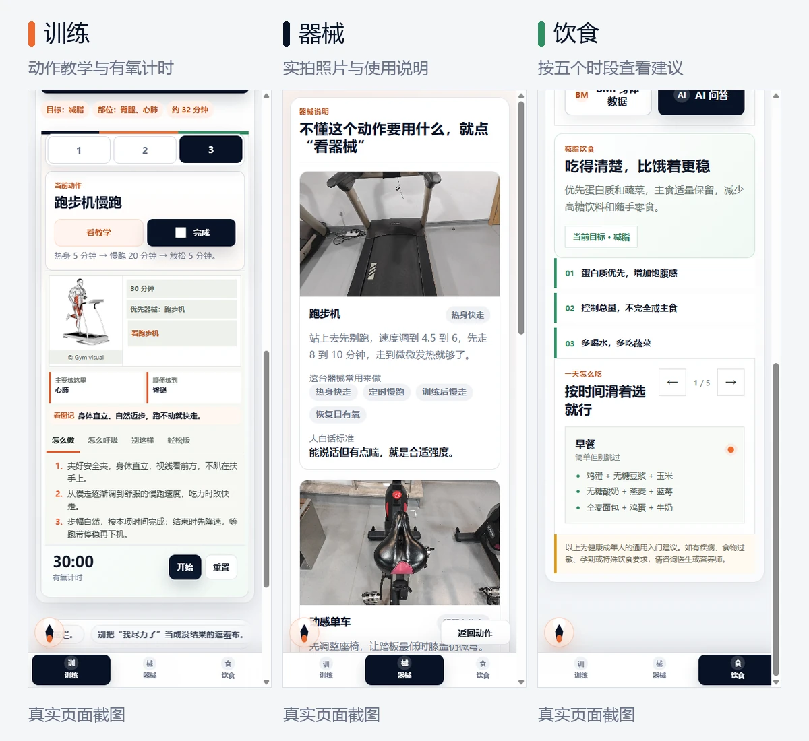

<p align="center">
  
</p>

# 健身小助手

给晚间训练新手的中文健身网站。选择增肌或减脂目标，按周计划查看动作、教学和组次，完成后逐项打卡。无需注册，没有账号和数据库。

**[在线使用](https://flyyang12-rgb.github.io/gym_excise_plus/)** · [快速启动](#快速启动) · [训练计划](#训练计划) · [开发与验证](#开发与验证) · [智能体说明](AGENTS.md)

<p align="center">
  
</p>

[训练原图](assets/readme/training.png) · [器械原图](assets/readme/equipment.png) · [饮食原图](assets/readme/diet.png)

截图来自本地 v2026.09.26.11，采集于 2026-09-26；在线页面以实际发布版本为准。

当前界面 v2026.10.07.3：训练页首屏显示选中的计划和时长，可点“开始本次训练”进入动作区；小人放大并在标题右侧的留白区居中，复用旧版四个姿势自动循环播放，无播放或暂停控件。离屏或页面隐藏时暂停，开启“减少动态效果”时显示静态小人。动作标题下直接显示组次，前后切换按钮位于动作卡底部。训练提示替代循环口号，饮食和恢复说明使用直接的文案。桌面使用居中底部导航，手机保留底部导航和动作选择栏。目标、频率和周历的选中状态支持读屏识别。

## 能做什么

| 功能 | 页面里的操作 |
| --- | --- |
| 周计划 | 切换增肌 / 减脂和每周 3 / 4 / 5 练，点击、滑动或用键盘选择训练日 |
| 动作教学 | 查看示范图、步骤、呼吸、常见错误和轻松版，打开教学抽屉 |
| 器械说明 | 从当前动作跳到器械实拍照片和说明，再返回原动作 |
| 计时与打卡 | 增肌动作间休息；减脂有氧三段计时与可选声音提醒；单项完成或整套打卡 |
| 饮食与记录 | 查看五个时段的饮食建议，修改 BMI 身体数据，保存训练小记 |
| AI 问答 | 根据当前目标和动作回答问题；接口不可用时显示本地建议 |

计划由本地模板生成，AI 不会自动改写计划。打卡和小记保存在当前浏览器；身高、体重、目标、频率及计时刷新后恢复默认状态。

## 快速启动

需要 Node.js 20 或更高版本。先下载仓库，再在项目根目录启动；当前没有第三方 npm 依赖，无需执行 `npm install`，也没有构建步骤。

```bash
git clone https://github.com/flyyang12-rgb/gym_excise_plus.git
cd gym_excise_plus
npm start
```

已有本地仓库时，在根目录直接执行 `npm start` 即可。

默认打开 [本地页面](http://localhost:5500/)。如果 `.env` 或终端环境中设置了 `PORT`，以启动日志显示的地址为准。按 `Ctrl+C` 停止服务。

也可以直接打开 `index.html`，但此方式只适合查看页面：动作示范图默认关闭，AI 使用本地兜底。推荐通过本地服务预览。

## 训练计划

| 目标 | 动作安排 | 参考时长 |
| --- | --- | --- |
| 增肌 | 以力量器械为主，按胸三头、背二头、腿核心等拆分 | 50–70 分钟 |
| 减脂 | 每天两个不同的简单动作，最后定时跑步或单车；无需躺卧、撑地或跳跃 | 27–43 分钟 |

### 增肌每周怎么排

| 频率 | 内置安排 |
| --- | --- |
| 每周 3 练 | 周一胸 + 三头；周三背 + 二头；周五腿 + 核心 |
| 每周 4 练 | 周一胸 + 三头；周二背 + 二头；周四腿 + 核心；周六肩 + 全身补强 |
| 每周 5 练 | 周一胸 + 三头；周二背 + 二头；周三腿 + 核心；周五肩 + 全身补强；周六全身循环补强 |

周日另有恢复日，可选择轻有氧和拉伸。部分增肌动作提供外部教程，页面内仍有动作教学。

### 减脂每天练什么

训练日保持 3 张动作卡：每天两个不同的简单动作，最后一张是跑步机 / 单车有氧。三练使用前三组、四练使用前四组、五练使用全部五组；每周前两项共 6 / 8 / 10 个动作，没有重复。有氧可以重复，交替安排跑步与骑车。

| 训练顺序 | 前两个动作 | 正式有氧 | 整次参考时长 |
| --- | --- | --- | --- |
| 第 1 天 | 徒手浅蹲、站姿提踵 | 跑步机 20 分钟 | 约 32 分钟 |
| 第 2 天 | 哑铃弯举、绳索下压 | 动感单车 20 分钟 | 约 38 分钟 |
| 第 3 天 | 坐姿器械推胸、坐姿高位下拉 | 跑步机 25 分钟 | 约 43 分钟 |
| 第 4 天 | 坐姿器械伸腿、扶稳站姿屈膝 | 动感单车 20 分钟 | 约 35 分钟 |
| 第 5 天 | 站姿侧屈、扶稳踝绕环 | 轻松骑车 15 分钟 | 约 27 分钟 |

开始前先轻松踏步活动身体。浅蹲、提踵、屈膝、侧屈和踝绕环各轻松活动 1 分钟，不加重量；弯举、下压、推胸、下拉和伸腿用轻配重做 2 组 × 10 次，组间自行休息 60-90 秒。重量以能稳定完成为准，不规定男女固定公斤数，不练到疲劳。轻配重器械动作属于力量练习，二头 / 三头补强不能定点减掉手臂脂肪，局部减脂说明参考 [ACE](https://contentcdn.eacefitness.com/assets/education-resources/lifestyle/fitfacts/pdfs/fitfacts/itemid_2668.pdf)。入门动作与组次参考 [ACE 新手力量训练说明](https://www.acefitness.org/resources/everyone/blog/8650/resistance-training-workouts-for-beginners/)，当前模板只保留少量动作，以有氧为主；可逐步增加日常快走。

最后一张卡合并低速热身 5 分钟、当天正式有氧和降速 5 分钟，倒计时提示阶段。前两项的参考时间包含简单器械调整和组间休息，整次约 27-43 分钟；实际用时可随调整器械和休息变化。减脂器械页面显示跑步机、动感单车、综合训练器和哑铃。

有氧计时突出显示当前的“热身 / 正式有氧 / 放松”，同时显示本阶段剩余时间和总剩余时间，三段进度会高亮当前阶段、标记已完成阶段。“声音提醒”默认关闭，手动开启时会先试听；阶段切换短响两声，全部结束短响三声，暂停、继续和重置不响。声音由浏览器直接生成，无需后端或音频下载，开关只在当前页面有效。手机锁屏或浏览器暂停后台页面时，声音提醒可能延迟；回到页面会按实际经过时间更新当前阶段，不补播错过的阶段。

| 频率 | 正式有氧安排（不含热身和降速） |
| --- | --- |
| 每周 3 练 | 周一跑步机 20 分钟；周三动感单车 20 分钟；周五跑步机 25 分钟 |
| 每周 4 练 | 周一跑步机 20 分钟；周二动感单车 20 分钟；周四跑步机 25 分钟；周六动感单车 20 分钟 |
| 每周 5 练 | 周一跑步机 20 分钟；周二动感单车 20 分钟；周三跑步机 25 分钟；周五动感单车 20 分钟；周六轻松骑车 15 分钟 |

跑步机先慢走 5 分钟，再逐渐转为舒服的慢跑，吃力时改快走；动感单车坐姿匀速骑行，不站姿冲刺。强度以还能说完整句子为准，新手可把正式有氧缩短到 10-15 分钟，提前结束时手动勾选完成。周日只展示一张 20 分钟恢复卡：慢走热身 5 分钟、轻松走 10 分钟、降速 5 分钟，也可以直接休息。热身与降速参考 [美国心脏协会的说明](https://www.heart.org/en/healthy-living/exercise-and-physical-activity/fitness-basics/warm-up-cool-down)。

## 怎么使用

1. **选目标和频率。** 在“训练”页选择增肌或减脂，再选择每周 3、4 或 5 练。
2. **选训练日和动作。** 点击周历或训练卡片，再按动作卡查看组次、示范图和教学；需要了解器械时点“看器械”，之后点“返回动作”。
3. **按计划计时。** 减脂轻重量动作组间自行休息 60–90 秒，做完全部组数后勾选，直接进入下一项。最后有氧支持开始、暂停、继续和重置，按高亮阶段调整运动节奏；需要声音时手动开启“声音提醒”。时间到只提示，仍需手动勾选。页面不会控制器械。
4. **完成打卡。** 单项可取消，“今日完成打卡”会标记当前计划的所有动作。增肌非最后一个动作完成后有 60 秒休息，可每次增减 15 秒（剩余 15–180 秒），或跳过后进入下一动作；最后一个动作不会回绕。
5. **看饮食或写小记。** 底部切换到“饮食”，查看早餐、午餐、训练前、训练后和可选加餐；通过 BMI 按钮修改身高体重。训练页“近 5 天小记”可写小记，每条最多 120 字。
6. **问 AI。** 在“饮食”页点“AI 问答”，描述具体动作和问题。AI 使用当前目标、身体数据、选中计划和动作信息；有回答不代表真实模型调用成功，验证方法见下方接口说明。

**打卡按操作当天保存。** 选择“周一”计划表示今天做这套训练，不是补签。切换目标、频率或训练日会重置当前动作及所有计时；切换动作也会清除有氧倒计时。上下班时间控件目前隐藏，页面使用内置默认时间。

## 数据保存与网络请求

| 数据 | 保存方式和限制 |
| --- | --- |
| 动作打卡 | `localStorage` 的 `fitness_helper_progress_v2`，按本地日期、计划 ID 和动作名称保存 |
| 训练小记 | `localStorage` 的 `fitness_helper_training_notes_v1`，最多保留最新 20 条；页面只显示近 5 天内最新 5 条 |
| 身高、体重、目标、频率及上下班时间 | 仅当前页面状态，刷新恢复默认值 |
| 当前动作、休息计时和 AI 对话 | 不做持久化，刷新不会恢复 |

本地记录不跨设备同步。浏览器、协议、域名或端口不同，记录也不共享；清除站点数据会删除记录，无痕窗口中的记录通常在关闭后消失。目前没有导出、导入或云端备份入口。暂时看不到小记时，先检查是否超出页面的时间或数量范围。

“本地保存”指打卡和小记。调用 AI 时，问题及 `getAiCoachContext()` 中的身高、体重、BMI、目标、频率、选中计划和动作信息会发送给后端，再由后端传给模型服务。当前不会发送打卡历史和训练小记。页面还会向 GitHub 请求最新提交信息，用于版本提示；该请求失败不影响训练。

## AI 配置与接口

localhost 页面默认使用线上 Vercel AI。本地 `.env` 只影响本地服务，不能直接改变前端请求目标。

<details>
<summary>展开：环境变量、请求目标和本地调试</summary>

### 配置本地模型服务

以下 PowerShell 命令仅在 `.env` 不存在时复制示例，避免覆盖已有配置：

```powershell
if (-not (Test-Path -LiteralPath .env)) {
    Copy-Item -LiteralPath .env.example -Destination .env
}
```

编辑 `.env`，填写自己的密钥；示例中的密钥默认为空：

```dotenv
DEEPSEEK_API_KEY=
DEEPSEEK_BASE_URL=https://api.deepseek.com
DEEPSEEK_MODEL=deepseek-v4-flash
PORT=5500
```

模型名是当前代码默认值，实际请填写服务商账户可调用的模型。修改 `.env` 后需要重启本地服务。服务启动时只填充尚未设置的环境变量，终端或系统中已有的同名变量优先。

| 用途 | 支持的名称，按读取优先级从左到右 | 未配置时 |
| --- | --- | --- |
| API 密钥 | `DEEPSEEK_API_KEY` → `OPENAI_API_KEY` → `AI_API_KEY` | 模型请求返回 `missing_api_key` |
| API 地址 | `AI_BASE_URL` → `DEEPSEEK_BASE_URL` | `https://api.deepseek.com` |
| 模型 | `AI_MODEL` → `DEEPSEEK_MODEL` → `OPENAI_MODEL` | `deepseek-v4-flash` |
| 本地端口 | `PORT` | `5500` |
| 允许的网页来源，仅 Node 接口 | `ALLOWED_ORIGIN` | `*` |

同一用途尽量只设置一个变量，避免高优先级别名覆盖预期配置。API 地址可以是根地址或完整的 `/chat/completions` 地址；代码只会追加 `/chat/completions`，不会自动补 `/v1`。需要 `/v1` 的服务应自行写入地址。

`ALLOWED_ORIGIN` 填写一个完整来源，例如 `https://flyyang12-rgb.github.io`，不含仓库路径；它不是逗号分隔的域名列表。当前 Edge 实现固定允许 `*`，不会读取此变量。

### 页面实际请求哪个 AI 接口

前端地址由 `script.js` 的 `AI_COACH_API` 决定，浏览器不会读取 `.env`。

| 页面打开方式 | AI 请求目标 | 动作示范图 |
| --- | --- | --- |
| `localhost` / `127.0.0.1`，任意端口 | `https://gym-excise-plus.vercel.app/api/ai-coach` | 启用 |
| `flyyang12-rgb.github.io` | 同上 | 启用 |
| 其他 HTTP(S) 域名，包括 Vercel 域名 | 同域 `/api/ai-coach` | 默认关闭 |
| 直接打开 HTML，`file://` | 无可用 HTTP API，转为本地建议 | 默认关闭 |

**本地启动了服务，不代表页面会调用本地 AI。** 修改本地密钥不会改变 localhost 页面默认使用的线上服务。

只检查本地接口时，在另一个 PowerShell 窗口执行下面的请求。若端口有修改，请替换地址中的 `5500`：

```powershell
Invoke-RestMethod -Uri 'http://localhost:5500/api/ai-coach' -Method Post -ContentType 'application/json; charset=utf-8' -Body '{"question":"你好"}'
```

预期返回含 `answer` 的对象，标题为“说具体点”。此请求不调用模型、不需要密钥，只验证路由和请求处理。验证真实模型时，将请求体改为 `{"question":"深蹲时如何控制动作速度？","context":{}}`；这会向配置的模型服务发起请求。

需要从页面完整调试本地 AI 时，临时将 `script.js` 中 localhost / `127.0.0.1` 分支改为：

```javascript
if (location.hostname === "localhost" || location.hostname === "127.0.0.1") {
  return "/api/ai-coach";
}
```

刷新时在开发者工具 Network 面板禁用缓存，确认请求地址是当前本地端口。调试后恢复该临时修改；若要永久改变路由策略，应同步修改本文中的环境表及资源缓存标识。当前没有可直接切换前端 API 地址的环境变量。

</details>

<details>
<summary>展开：POST /api/ai-coach 请求、响应与错误码</summary>

入口为 `POST /api/ai-coach`，请求类型为 `application/json`：

```json
{
  "question": "深蹲时如何控制动作速度？",
  "context": {
    "profile": { "goal": "增肌" },
    "todayWorkout": { "currentExercise": "史密斯深蹲" }
  }
}
```

`question` 必填，`context` 可省略。通过问题筛选后，发给模型的问题最多保留 800 个字符。成功响应结构如下，文字仅作示例：

```json
{
  "answer": {
    "title": "动作节奏",
    "lead": "根据当前动作给出一句具体建议。",
    "steps": [],
    "warning": "稳住节奏继续变强"
  }
}
```

服务端将标题限制为 10 个字符、主要回答限制为 90 个字符、`steps` 最多保留 1 条，`warning` 规范为 8 个汉字。前端等待响应头的超时设置是 10 秒；读取响应体和后端模型调用没有单独配置超时。前端失败后显示本地建议，但不显示具体错误码。

| 结果 | 含义和检查方向 |
| --- | --- |
| `200`，标题“说具体点” | 问题未通过训练相关筛选，没有调用模型 |
| `400`，`Question is required` | 缺少问题或问题为空 |
| `405`，`Method not allowed` | Node 接口不接受该方法；浏览器地址栏直接访问是 GET |
| `500`，`missing_api_key` | 处理此次请求的后端没有有效密钥配置 |
| `model_request_failed`，状态码来自上游 | 检查后端日志中的密钥、地址、模型名和上游错误 |
| `ai_coach_unavailable` | 请求解析、网络或其他处理异常，检查后端日志 |

接口还支持 `OPTIONS` 预检。Node 与 Edge 的提示词及部分错误处理存在差异，不应将两者视为完全相同的实现。

</details>

## 部署

前端可以独立作为静态网站使用；AI 需要另行配置服务端。推送成功不代表部署已完成。

<details>
<summary>展开：GitHub Pages、Vercel 与 Cloudflare Pages Functions</summary>

当前前端代码指向上面的 GitHub Pages 页面和 Vercel AI 地址。以下是按仓库结构配置平台的步骤，不代表已核验平台控制台中的发布设置。仓库目前没有 CI 工作流，推送不会自动运行本地测试。

### GitHub Pages：静态前端

1. 将代码推送到仓库。
2. 在仓库的 **Settings → Pages → Build and deployment** 中选择 **Deploy from a branch**，发布分支选 `main`，目录选 `/(root)`，保存。已有发布配置时先检查，不必重复更改。
3. 等待 Pages 发布完成，在 Actions / Pages 中确认结果，再打开网页检查资源加载。

此步骤对应 GitHub 官方的[从分支发布说明](https://docs.github.com/en/pages/getting-started-with-github-pages/configuring-a-publishing-source-for-your-github-pages-site)。GitHub Pages 不运行本项目的 Node API；AI 由单独的服务端提供。Fork 仓库或使用自定义域名后，需要检查 `AI_COACH_API` 和 `EXERCISE_MEDIA_ENABLED`，原有域名判断不会自动匹配新地址。

### Vercel：Node AI 接口

1. 导入 GitHub 仓库，项目根目录选择仓库根目录。按本项目的静态文件加 `/api` 函数结构，选择 **Other**，覆盖 Build Command 并留空，输出目录用 `.`。这是无需构建的配置方式，见 [Vercel 构建说明](https://vercel.com/docs/builds/configure-a-build)。
2. 在项目环境变量中填写模型密钥、API 地址和模型名，选择需要的 Production / Preview 环境。密钥只放服务端环境配置，见 [Vercel 环境变量说明](https://vercel.com/docs/environment-variables)。
3. 创建部署，确认 `/api/ai-coach` 被识别为函数。仓库入口 `api/ai-coach.js` 复用根目录的 `ai-coach-handler.js`，见 [Node 函数说明](https://vercel.com/docs/functions/runtimes/node-js)。这里不以 `npm start` 启动生产服务。
4. 将本地接口验证示例中的地址替换为部署地址，先验证固定回答，再验证真实模型请求。若前后端分开部署，检查 CORS 允许的来源。
5. 若使用了新的 AI 服务域名，修改前端 `AI_COACH_API` 中对应地址并发布前端。修改 Vercel 环境变量后，需要创建新部署才能生效。

### Cloudflare Pages Functions：可选适配

`edge-functions/api/ai-coach.js` 是适配源码，仓库尚未配置成可直接发布的 Cloudflare Pages Functions 项目。Cloudflare 默认从项目根目录的 `functions/` 识别函数，不会自动识别这里的 `edge-functions/`，见 [Pages Functions 官方说明](https://developers.cloudflare.com/pages/functions/get-started/)。

采用此方案时，在独立部署分支将适配源码复制为 `functions/api/ai-coach.js`，配置静态输出目录及服务端环境变量，再部署并验证 `/api/ai-coach`。更新源码时同步部署副本。普通域名会使用同域 API，但动作示范图仍需检查域名开关。当前 Edge 的 CORS 固定为 `*`，设置 `ALLOWED_ORIGIN` 不会改变它。

`server.js` 用于本地开发预览：它直接读取项目根目录文件，没有生产级的静态资源隔离，不要将包含 `.env` 的开发目录直接公开为生产站点。发布静态资源时只包含前端所需文件；不要上传本地 `.env`。`.env.example` 可以提交，真实密钥不能写入前端资源、文档或 Git 历史。

</details>

## 常见问题

| 现象 | 检查方法 |
| --- | --- |
| 本地页面打不开 / `EADDRINUSE` | 检查 Node 版本、启动日志和 `PORT`；端口被占用时换一个端口后重启 |
| 改了本地密钥，网页回答没变化 | localhost 默认请求线上接口，按“页面实际请求哪个 AI 接口”验证目标地址 |
| AI 能回答，但不确定是否联网 | 查看 Network 是否有 POST 请求及其结果；宽泛问题和接口失败都可能返回本地建议 |
| AI 接口返回 HTML 或 404 | 检查域名、函数部署路径；静态站点不会自动执行服务端文件 |
| 部署后动作没有示范图 | 检查 `EXERCISE_MEDIA_ENABLED` 的域名名单、`exercise-media/` 文件路径和大小写；开关关闭时仍提供文字教学 |
| 刷新后资料或计时消失 | 当前没有持久化这些状态，属于现有行为 |
| 打卡或小记不见了 | 检查是否换了浏览器、域名、端口或日期，是否清理了站点数据；小记还受显示范围限制 |
| 保存小记或打卡失败 | 检查浏览器是否禁用站点存储、空间是否不足；当前写入失败没有专门提示，检查 Console |
| 修改样式或脚本后还是旧页面 | 确认发布完成，更新被修改资源的 `?v=`，再禁用缓存刷新 |

## 项目结构

```text
.
├── index.html                    # 页面结构、模块入口与脚本加载顺序
├── style.css                     # 样式、响应式布局和主题
├── script.js                     # 训练模板、页面状态、渲染和交互
├── exercise-guides.js            # 动作教学、别名、媒体映射、计时工具
├── diet-guide.js                 # 增肌 / 减脂分时段饮食内容
├── images/                       # 器械与主题图片
├── exercise-media/               # 动作 GIF 和定制示范图
├── assets/readme/                # 仓库首页 SVG、截图与素材说明
├── server.js                     # 本地静态服务与 AI 路由
├── ai-coach-handler.js            # Node AI 请求处理
├── api/ai-coach.js                # Vercel Node 函数入口
├── edge-functions/api/ai-coach.js # 可选 Pages Functions 适配源码
├── test/                         # Node 内置测试
├── .env.example                  # 无密钥的配置模板
├── package.json                  # 运行和测试命令
├── AGENTS.md                     # 智能体开发约束与验证清单
└── CLAUDE.md                     # 指向 AGENTS.md 的入口
```

## 开发与验证

```bash
npm test
node --check script.js
node --check exercise-guides.js
node --check diet-guide.js
node --check server.js
node --check ai-coach-handler.js
node --check api/ai-coach.js
```

`npm test` 等价于 `node --test`，使用 Node 内置测试运行器。现有测试覆盖饮食配置、动作别名与示范图映射、未匹配动作兜底、媒体开关、近似示范标记、计时计算、动作索引边界、减脂每天两个不同动作且全周不重复、倒计时暂停 / 继续 / 到时 / 重置、阶段边界与剩余时间、声音默认关闭 / 不重复提醒 / 不可用兜底及旧记录保留；页面逻辑在隔离 VM、模拟时间和模拟音频接口中验证，不覆盖浏览器布局、真实声音输出、真实 AI、存储读写或部署。

Edge 文件使用 ES module 导出，仓库根目录使用 CommonJS。在 PowerShell 中可按模块语法检查：

```powershell
Get-Content -Raw -LiteralPath edge-functions/api/ai-coach.js | node --input-type=module --check
```

减脂计划保留原来的 `matFlow1`–`matFlow5` / `matRecovery` 键、周安排和计划 ID，各频率使用 `fatLossExercisePairs` 中的不同搭配与 `fatLossWorkouts` 的最后有氧组合。同一计划内同名动作继续读取原打卡记录；动作移到不同计划或改名后不会跨计划迁移。移除的垫上动作、独立器械热身 / 放松及其他旧动作记录留在存储中，但不计入新计划，也不转换成有氧完成记录。

修改界面后，在桌面和手机宽度下检查受影响流程；共享功能需覆盖增肌、减脂及 3 / 4 / 5 练组合。完整检查项目见 [AGENTS.md](AGENTS.md)。

修改 `style.css`、`script.js`、`exercise-guides.js` 或 `diet-guide.js` 后，更新 `index.html` 中对应资源的 `?v=`。各资源版本可以不同。发布新界面版本时同时更新 `script.js` 的 `APP_VERSION` 和 HTML 的初始版本文字；仅文档更新无需修改页面版本。

## 素材与使用范围

动作示范图、实拍截图与代码的使用范围应分别确认。仓库目前没有单独的代码许可证，复用代码前请联系维护者；第三方动作素材不因放入仓库而改变授权范围。

<details>
<summary>展开：GIF 来源、近似示范、定制图片与截图说明</summary>

所有减脂动作沿用与增肌相同的灰色人体、红色肌肉 GIF。素材来自 [exercises-dataset](https://github.com/MrZaKaRiA/exercises-dataset)：浅蹲 `3119-75Bgtjy.gif`、提踵 `1373-bJYHBIN.gif`、弯举 `0294-NbVPDMW.gif`、下压 `0201-3ZflifB.gif`、坐姿推胸 `0577-T0yTjgW.gif`、坐姿下拉 `0198-RVwzP10.gif`、器械伸腿 `0585-my33uHU.gif`、站姿屈膝 `0795-C5jncD2.gif`、站姿侧屈 `0794-1jXLYEw.gif`、踝绕环 `1368-uL9CsKm.gif`。GIF 未修改，保留 Gym visual 署名；数据集声明仅供教育和非商业研究使用。浅蹲原素材为 `potty squat`，文字只做小幅度；推胸、下拉、伸腿展示同类器械，实际调整按现场器材标识，均保留近似标记。减脂坐姿下拉单独映射 GIF，增肌高位下拉的定制图片与说明保留。跑步机慢跑使用 `0684-y5p0H8a.gif`；恢复快走复用 `3666-rjiM4L3.gif`（图示为坡度走，保留近似标记，可用平坡）；单车复用 `2138-H1PESYI.gif`。图片沿用现有媒体域名开关，关闭或加载失败时仍可用文字教学。

高位下拉说明明确采用面向器材的坐姿，配图为 `exercise-media/custom-lat-pulldown-facing.png`。图片由内置 imagegen 参考原定制图和器材照片修正，仅作姿势示意；实际座椅及压腿垫设置以器材标识为准。生成提示见 [素材说明](exercise-media/custom-lat-pulldown-facing.md)。常规动作方向参考 [PureGym 高位下拉指南](https://www.puregym.com/exercises/back/lat-exercises/)。

哑铃飞鸟使用与现有动作一致的灰色人体、红色肌肉 GIF：`exercise-media/0308-yz9nUhF.gif`。原文件来自 [ExerciseDB 数据集的哑铃飞鸟素材](https://github.com/MrZaKaRiA/exercises-dataset/blob/main/videos/0308-yz9nUhF.gif)，未修改，页面保留 Gym visual 署名。该数据集声明仅供教育和非商业研究使用；商业复用须另行确认素材权利。示范图只展示动作，不表示图中重量为 5 kg。

增肌胸部训练第三项明确使用两只哑铃和平卧推凳，页面显示“哑铃飞鸟”。改名前“夹胸 / 飞鸟”的同一计划打卡记录仍能读取；新名称下的明确勾选或取消优先，旧记录保留。

README 使用静态 SVG 和真实页面截图，制作与更新方式见 [视觉素材说明](assets/readme/source/README.md)。

</details>

---

[打开健身小助手](https://flyyang12-rgb.github.io/gym_excise_plus/) · [查看仓库](https://github.com/flyyang12-rgb/gym_excise_plus)
